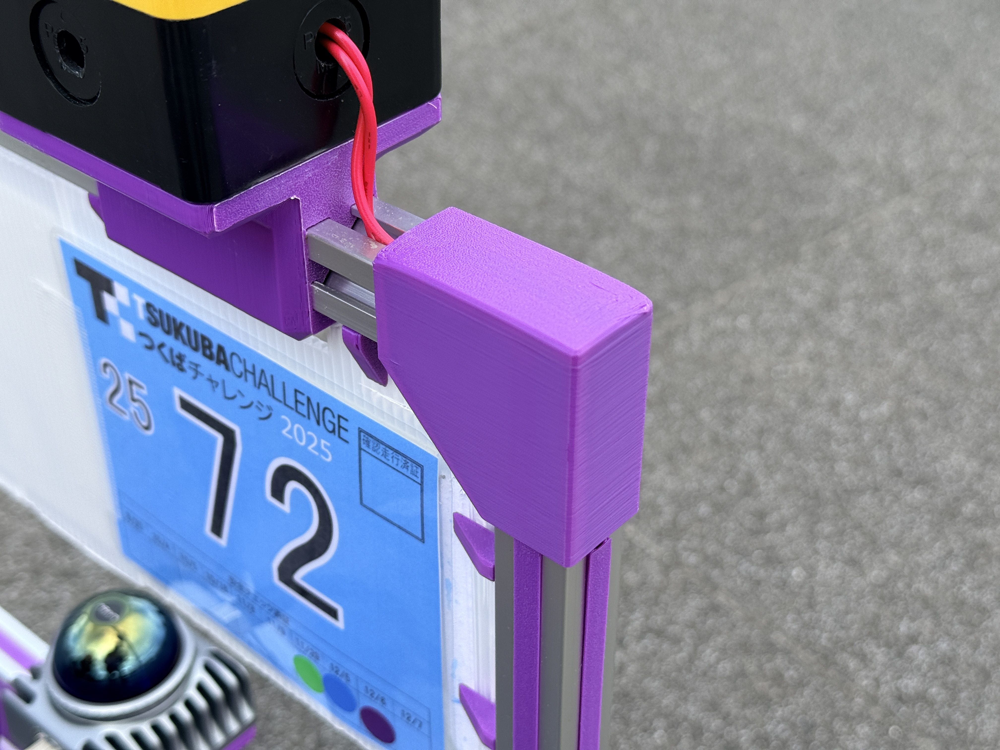
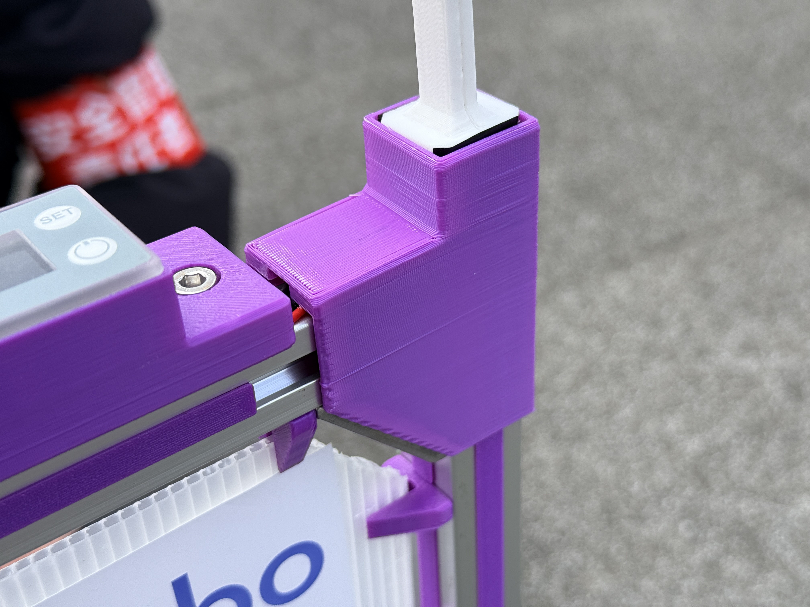
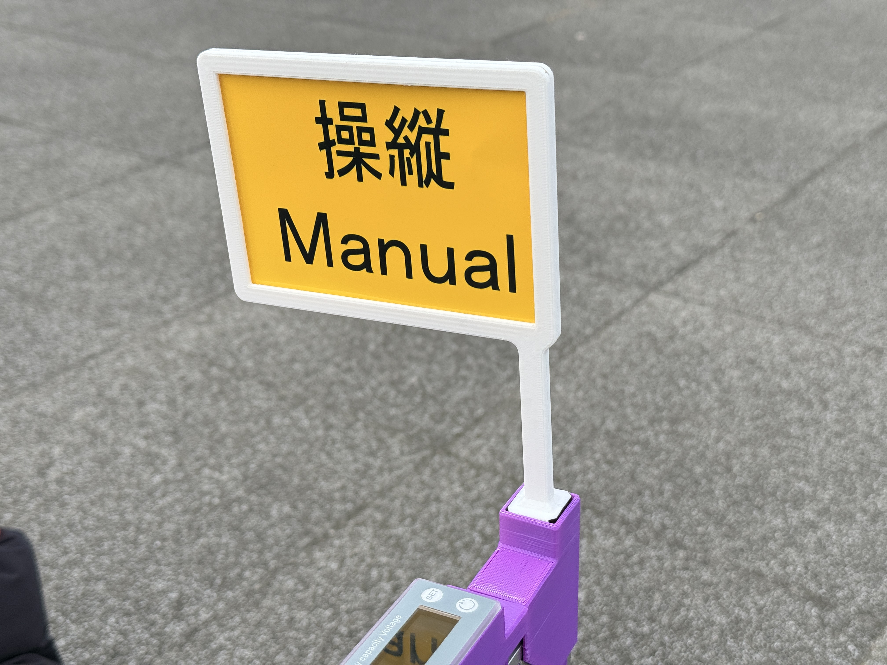

# Corner Cover and Flag Mount

The Corner Cover protects the corners of the gantry's aluminum extrusions
while providing a path for cables through the inside of the part. The related
Flag and FlagBase parts mount the chosen operating-mode flag at a corner of
the gantry frame.

## Key Features & Specifications

- Protects exposed corners of the aluminum frame.
- Allows cables to pass through the cover.
- Implements the Tsukuba Challenge operating-mode display requirement with a
  flag: a green
  background marked "自律 / Auto" during autonomous driving and a yellow
  background marked "操縦 / Manual" during manual operation, positioned so it
  is visible from around the robot.

## References

- [ThermaeTech/tuk-tuk_phoenix issue #48](https://github.com/ThermaeTech/tuk-tuk_phoenix/issues/48)
- [ThermaeTech/tuk-tuk_phoenix issue #46](https://github.com/ThermaeTech/tuk-tuk_phoenix/issues/46)
