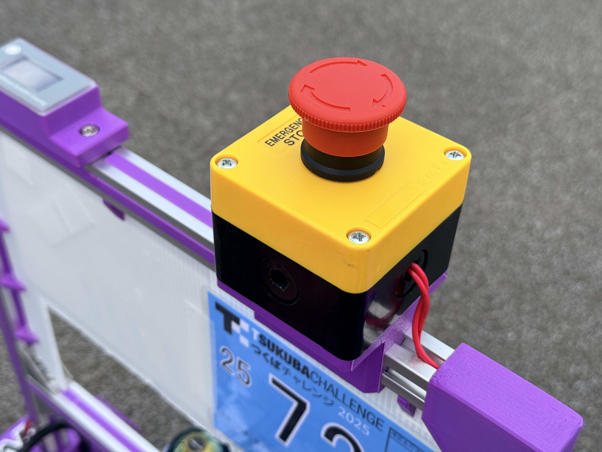

# E-Stop Base

This part is a mounting base for the robot's emergency-stop button.

## Key Features & Specifications

- Mounts the emergency-stop button on the robot.
- The design conclusion was to open the circuit between the motors and motor
  drivers with relays so that pushing the robot does not cause current to flow
  through the drivers.
- This approach requires break-before-make switching timing.

For the full design rationale, see the "モータの非常停止・逆起電力対策"
section of `personal-kb/projects/tsukuba.md` and the issue below.

## References

- [ThermaeTech/tuk-tuk_phoenix issue #87](https://github.com/ThermaeTech/tuk-tuk_phoenix/issues/87)
