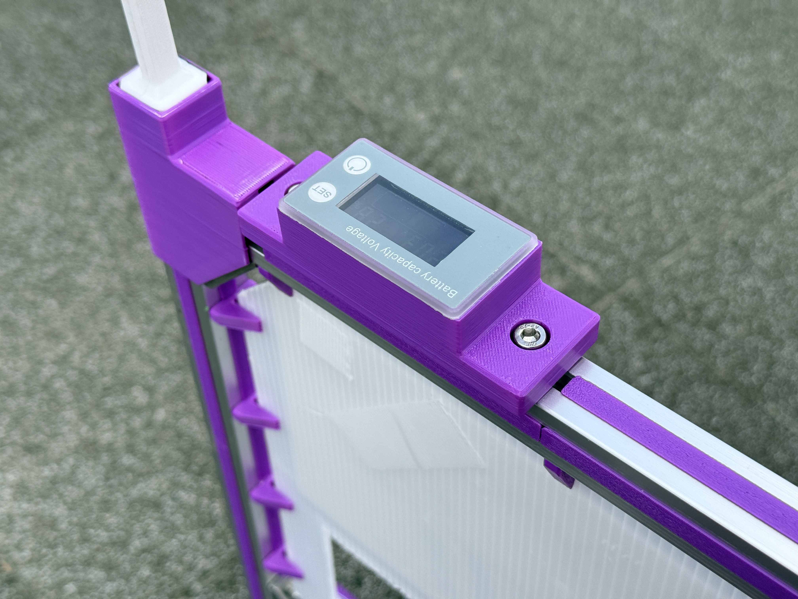

# Voltmeter Base

This part mounts a purchased digital voltmeter that displays the traction
battery voltage. The voltmeter is available from the referenced
[product page](https://amzn.asia/d/d278KUw).

## Key Features & Specifications

- Designed to be secured above the handle.
- Uses a PH connector for wiring.

## References

- [ThermaeTech/tuk-tuk_phoenix issue #31](https://github.com/ThermaeTech/tuk-tuk_phoenix/issues/31)
