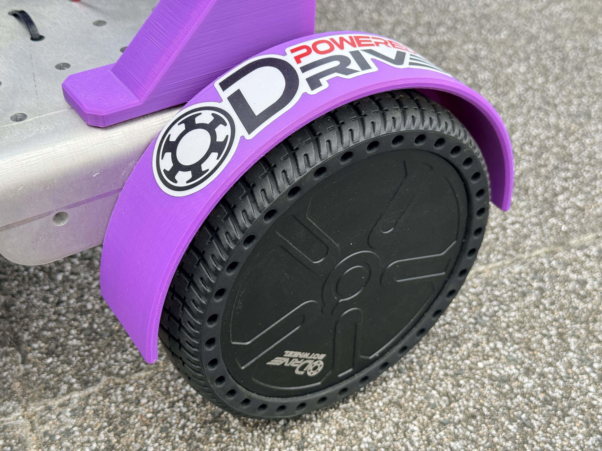

# Wheel Cover

The Wheel Cover protects the wheels of the BotWheel Explorer.

## Key Features & Specifications

- Installed and tested on the robot.
- Confirmed not to affect driving performance.

## References

- [ThermaeTech/tuk-tuk_phoenix issue #48](https://github.com/ThermaeTech/tuk-tuk_phoenix/issues/48)
